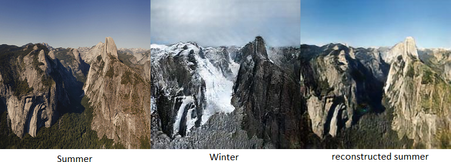
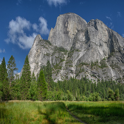
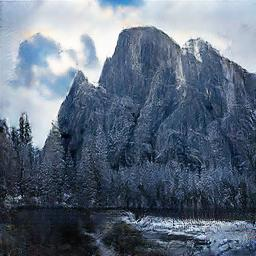
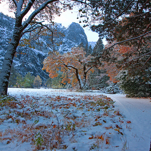
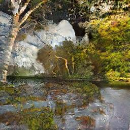

# Pytorch-CycleGANs
Implementation of CycleGANs in pytorch :heart:

This models and the training procedure of the model is based on [Unpaired Image-to-Image Translation using Cycle-Consistent Adversarial Networks](https://arxiv.org/abs/1703.10593)  

I have trained the model on Summer and Winter photos from Yosemite National Park. Use it to convert images from Summer to Winter and vice versa.  

  

Here, I have included a couple of results from the model. There are many cases in which model tried to convert the image but failed to do so. Check the `ims` folder for all the images and results of the model.  

&nbsp;&nbsp;&nbsp;&nbsp;&nbsp;  
&nbsp;&nbsp;&nbsp;&nbsp;&nbsp;&nbsp;&nbsp;&nbsp;&nbsp;&nbsp;&nbsp;&nbsp;&nbsp;&nbsp;&nbsp;&nbsp;&nbsp;&nbsp;&nbsp;&nbsp;&nbsp;&nbsp;&nbsp;&nbsp;&nbsp;&nbsp;&nbsp;&nbsp;&nbsp;&nbsp;&nbsp;&nbsp;&nbsp;&nbsp;&nbsp;&nbsp;&nbsp;&nbsp;&nbsp;&nbsp;&nbsp;&nbsp;&nbsp;&nbsp;&nbsp;&nbsp;&nbsp;&nbsp;&nbsp;&nbsp;&nbsp;&nbsp;&nbsp;&nbsp;&nbsp;&nbsp;__Summer to Winter__  

&nbsp;&nbsp;&nbsp;&nbsp;&nbsp;  
&nbsp;&nbsp;&nbsp;&nbsp;&nbsp;&nbsp;&nbsp;&nbsp;&nbsp;&nbsp;&nbsp;&nbsp;&nbsp;&nbsp;&nbsp;&nbsp;&nbsp;&nbsp;&nbsp;&nbsp;&nbsp;&nbsp;&nbsp;&nbsp;&nbsp;&nbsp;&nbsp;&nbsp;&nbsp;&nbsp;&nbsp;&nbsp;&nbsp;&nbsp;&nbsp;&nbsp;&nbsp;&nbsp;&nbsp;&nbsp;&nbsp;&nbsp;&nbsp;&nbsp;&nbsp;&nbsp;&nbsp;&nbsp;&nbsp;&nbsp;&nbsp;&nbsp;&nbsp;&nbsp;&nbsp;&nbsp;__Winter to Summer__

## Usage

The pretrained checkpoints can be loaded (trained only on summer2winter for now) and be used directly for conversion with `convert.py`. The images will scale down to a resolution of __256x256__.  

> `--src`: Path to the source image.  
> `--dest`: Path to the destination folder.  
> `--ckpth`: Path to the folder containing the checkpoints.  
> `--YtoX`: Convert image from domain Y to X rather than from X to Y.  

For training the model from scratch with a different dataset, It is highly recommended to use a larger batch size as the training is really slow (_took about 14hrs on P100 to train it on approx 2.1k images for 200 epochs with a batch size of 1_). The script `train.py` contains following arguments:  

> `--datasetA`: Path to dataset containing images from domain A.  
> `--datasetB`: Path to dataset containing images from domain B.  
> `--ckpth` (default: './'): Path for storing the checkpoints of the model.  
> `--num_epochs` (default: 200): Number of epochs for training the model.  
> `--batch_size` (default: 1): The batch size for loading the training data.  
> `--cycle_weight` (default: 10): Weight for the cycle consistency loss.  
> `--num_res_blocks` (default: 9): Number of residual blocks in the generators.  
> `--lr` (default: 0.0002): The initial learning rate of the Adam optimizer.  
> `--beta1` (default: 0.5): Adam optimizer hyperparameter.  
> `--beta2` (default: 0.999): Adam optimizer hyperparameter.  
> `--decay_epoch` (default: 100): Number of epochs upto which learning rate stays constant.  
> `--continue_train` (default: False): Continue the training.  
> `--device` (default: cpu): Training Device.  
